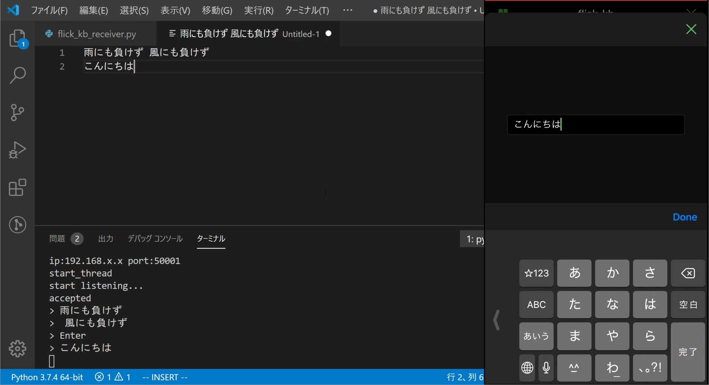

# [Pyto] PC用フリックキーボード


iOS端末をPC用のフリックキーボードにするプログラムです．iOS側のプログラムは[Pyto](https://pyto.app/)というアプリの上で動作します．

## 動作確認環境
[iOS側]  
iPhone SE 2020 (iOS13.4.1)  
Pyto (12.0.3)  

[PC側]  
Windows 10 Home 64bit (1909)  
Python 3.7.4  
 
ライブラリ  
pyautogui (0.9.50)  
pyperclip (1.8.0)

## 動作手順
### ファイル配置
[PC]
```
flick_kb_receiver.py
```

[iOS]
```
flick_keyboard（任意のフォルダ）
├── flick_kb.py （実行ファイル）
├── text_client.py
```

### 実行手順
#### 接続
1. PC側でポート番号をコマンドライン引数として実行  
   例：`python flick_kb_receiver.py 50001`
2. iOS側のPytoアプリで`flick_kb.py`を開き，右下の歯車マークを押す．その中のArgumentsにポート番号とIPアドレスを入力後，実行  
    例：`50001 192.168.1.2`
3. PCで任意のテキストエディタや検索窓等にカーソルを合わせる
4. iOS側のテキストボックスに入力確定後，再度確定を押す
5. PC側にテキストが入力される

#### 切断，終了
1. iOS側のプログラムを停止
2. PC側のコンソールに"s"を入力し、PC側のプログラムを停止

iOS側でimport部のエラーが出た場合は，フォルダアクセスが許可されていないと思うので，Pytoエディタ画面右下の南京錠マークから許可してください． 

PC側の初回起動時にファイアウォールのアクセス許可が出ますが，パブリックアクセスを許可しないとつながりませんでした．
